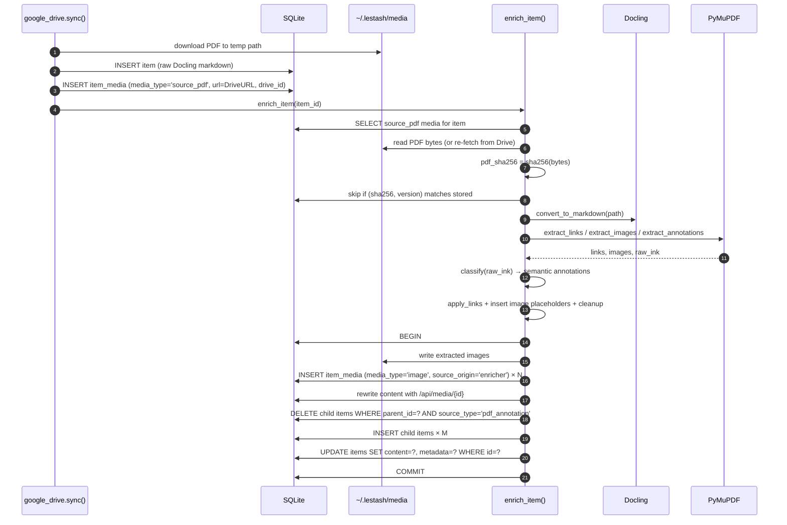
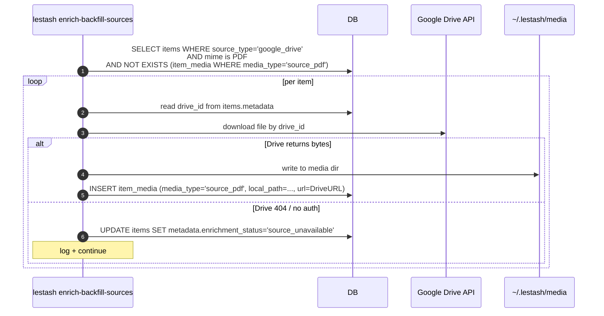
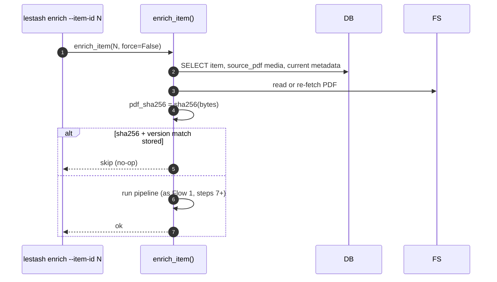
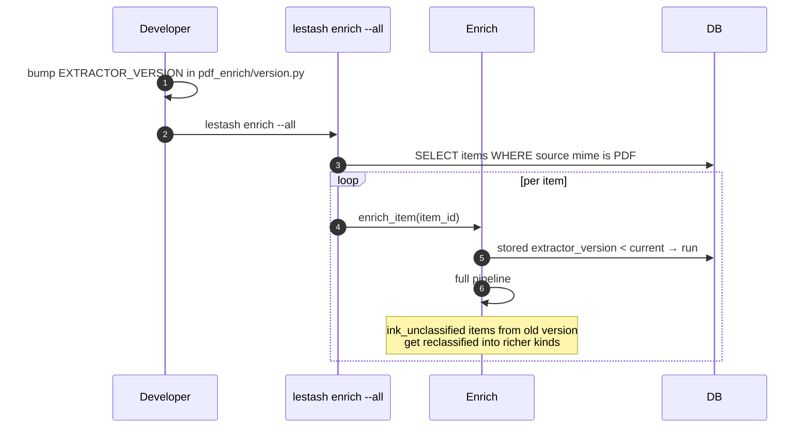
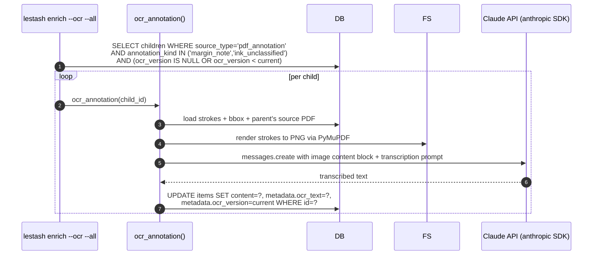

# PDF Enrichment Design

*Designed 2026-04-26 — Implementation pending*

Companion to [`docs/adr/0001-pdf-enrichment-pipeline.md`](adr/0001-pdf-enrichment-pipeline.md). The ADR fixes the load-bearing decisions; this document describes how to build it.

## Overview

A two-library pipeline that produces a fully enriched markdown item from a PDF:

```
PDF bytes ──> Docling ──> structured markdown (headings, sections, tables)
         └─> PyMuPDF ──> links + images + ink annotations
                    │
                    └─> classifier ──> semantic annotations
                                     (underline, circle, margin_note, ink_unclassified)

merge ──> EnrichedPdf { content, images[], annotations[], pdf_sha256, extractor_version }
        │
        └─> persistence layer ──> items.content, item_media rows, child items
```

The pipeline is callable inline from sync and standalone for backfill. Idempotency is keyed on `(pdf_sha256, extractor_version)`.

## Components

### `lestash.core.pdf_enrich` (new module)

Single public entry point:

```python
def enrich_pdf(pdf_path: Path) -> EnrichedPdf: ...
```

Pure: takes a path, returns a structured result. No DB access, no network. Trivially testable with fixture PDFs.

```python
@dataclass
class EnrichedPdf:
    content: str                          # markdown with [text](url) links and  image refs
    pdf_sha256: str
    extractor_version: int
    images: list[ExtractedImage]
    annotations: list[ExtractedAnnotation]

@dataclass
class ExtractedImage:
    placeholder_index: int                # which <!-- image --> in the markdown this replaces
    page: int
    bbox: tuple[float, float, float, float]
    bytes: bytes
    mime_type: str                        # 'image/png', 'image/jpeg'
    xref_hash: str                        # sha256 of bytes — for dedup within a doc

@dataclass
class ExtractedAnnotation:
    kind: Literal['underline', 'circle', 'margin_note', 'ink_unclassified']
    page: int
    bbox: tuple[float, float, float, float]
    anchor_text: str                      # text the annotation points at, '' if none
    color: str | None
    strokes: list[list[tuple[float, float]]]   # raw geometry, preserved for replay
    annotation_id: str | None             # PDF /NM (annotation UUID) from annot.info["id"], used for cross-run dedup
    created_at: str | None                # ISO-8601 from annot.info["creationDate"] (Kobo populates this)
```

Internal layout:
- `pdf_enrich/__init__.py` — `enrich_pdf` orchestrator
- `pdf_enrich/links.py` — `extract_links(doc) -> list[Link]` and `apply_links(markdown, links) -> markdown`
- `pdf_enrich/images.py` — `extract_images(doc) -> list[ExtractedImage]` with `xref_hash` dedup
- `pdf_enrich/annotations.py` — `extract_annotations(doc) -> list[RawInk]` + `classify(strokes) -> ExtractedAnnotation`
- `pdf_enrich/cleanup.py` — strip `·`/`◦` artifacts when they appear as the **last** non-whitespace character of a line (Docling's actual output puts them at end-of-line, e.g. `"...and preprints. ·\n"`)
- `pdf_enrich/version.py` — `EXTRACTOR_VERSION: int = 1`

### `lestash.core.pdf_enrich.persistence` (DB-aware glue)

Maps an `EnrichedPdf` to database mutations. Owned by the caller (CLI / API), not by the pure extractor.

```python
def persist_enrichment(conn: Connection, item_id: int, enriched: EnrichedPdf) -> None: ...
```

Responsibilities:
- Upload images via existing `add_item_media` and rewrite `placeholder:N` refs to `/api/media/{id}`.
- Delete prior enrichment-derived child items (`WHERE parent_id = ? AND source_type = 'pdf_annotation'`) before re-inserting the new set.
- Write `items.content` and bump `metadata.pdf_sha256` + `metadata.extractor_version` + `metadata.enriched_at`.
- Run inside a transaction.

### `lestash.core.pdf_enrich.ocr` (separate, opt-in)

```python
def ocr_annotation(child_item_id: int, ocr_version: int) -> str | None: ...
```

Renders the stroke geometry to PNG via PyMuPDF, sends to **Claude multimodal vision** via the existing `anthropic` SDK with a fixed transcription prompt, writes the result to the child item's `content`. Skipped if `metadata.ocr_version == current`. See "OCR pass" in flows.

Claude was chosen over Google Cloud Vision / Document AI / RapidOCR because prior tests on real Kobo annotation samples showed RapidOCR scoring 0.50–0.70 on handwriting while Claude transcribed the same samples cleanly. The `anthropic` SDK is already a project dependency.

### Invocation surfaces

- `lestash enrich [--item-id N | --all] [--ocr] [--force]` (CLI)
- `POST /api/items/{item_id}/enrich` (server, idempotent body)
- Inline call from `lestash.core.google_drive.sync()` after item insert
- Inline call from the Kobo source plugin's sync path — Kobo-sourced PDFs arrive via either the differential USB backup (#133, dropping files into `~/.local/share/kobo-backup/pdfs/`) or the WiFi push (#134, hitting `POST /api/kobo/process-new`). Both create regular items and then call the same `enrich_item()`. Kobo PDFs are particularly valuable here because they typically carry the ink annotations the geometric classifier and OCR pass are designed for.

All surfaces resolve to the same `enrich_item(item_id)` function in `lestash.core.pdf_enrich.runner`. Source-of-PDF differences (Drive download, Kobo USB rsync, Kobo WiFi push, direct upload) only affect how the `source_pdf` `item_media` row is populated; the enricher itself is source-agnostic.

## Data Model Deltas

### Migration 8: enrichment metadata + source-PDF role

```sql
-- No new columns: piggyback on items.metadata (JSON TEXT) and item_media.media_type.
-- Documenting the conventions here:
--
-- items.metadata JSON keys (added):
--   pdf_sha256          : str
--   extractor_version   : int
--   enriched_at         : ISO-8601 string
--   enrichment_status   : 'ok' | 'source_unavailable' | 'failed'
--
-- item_media.media_type new value:
--   'source_pdf'        : the original PDF, either local_path or url+Drive file ID
--
-- item_media.source_origin new value (existing column, default 'sync'):
--   'enricher'          : marks an image extracted from a PDF by the enricher;
--                         media_type stays 'image' (no new type needed — source_origin
--                         already exists for exactly this kind of provenance distinction)
--
-- items.source_type new value for child annotations:
--   'pdf_annotation'    : a child item created by the enricher
--
-- For pdf_annotation children, items.metadata JSON keys:
--   annotation_kind     : 'underline' | 'circle' | 'margin_note' | 'ink_unclassified'
--   page                : int
--   bbox                : [x0, y0, x1, y1]
--   color               : str | null
--   strokes             : [[[x, y], ...], ...]
--   stroke_geometry_hash: str   -- sha256 of canonicalised strokes, used as OCR cache key
--   ocr_text            : str | null
--   ocr_version         : int | null
```

No DDL changes are strictly required — every field fits the existing schema. The migration is a no-op SQL file whose purpose is to record the convention bump in `schema_migrations`.

### Conventions, written down

- **`source_type='pdf_annotation'`** identifies child items produced by the enricher. The persistence layer deletes-then-inserts these on every successful run.
- **`media_type='source_pdf'`** identifies the original PDF. The enricher reads from this row's `local_path` or `url` (Drive ID).
- **`media_type='image'` with `source_origin='enricher'`** identifies an enricher-produced image. These are deleted-then-inserted on every successful run, just like child items. The existing `source_origin` column already exists to distinguish provenance — no new media type is needed.
- **`extractor_version`** is a single integer in `pdf_enrich/version.py`. Bump it when the extractor changes in a way that should trigger reprocessing.

## Sequence Flows

### Flow 1: New import (Google Drive PDF)



### Flow 1.5: Source-PDF backfill for legacy items

Approximately 250 PDF items already imported from Google Drive predate this pipeline and have no `source_pdf` `item_media` row. D5 makes that row mandatory, so a one-shot backfill is required before `enrich --all` can be run end-to-end.



This command is idempotent (skips items that already have a `source_pdf` row) and runs once after the migration lands. After it completes, `enrich --all` is the canonical re-runner.

### Flow 2: Backfill (re-enrich existing item, same extractor version)



### Flow 3: Re-extraction after extractor improvement



### Flow 4: Handwriting OCR pass



## Failure Modes

| Mode | Behaviour |
|---|---|
| Source PDF unavailable (Drive 404, deleted, no auth) | `enrichment_status='source_unavailable'`, log warning, leave existing content intact, exit success. |
| Docling crash | Fall through: keep prior `items.content` if any, set `enrichment_status='failed'`, log full exception. |
| PyMuPDF crash on a single page | Page-level try/except; record empty results for that page, continue with others. |
| Image upload fails | Roll back the entire enrichment transaction; item is left in its prior state. |
| Claude API failure (rate limit, network, auth, content-policy refusal) | Skip child, leave its `content` unchanged, log; resumable on next `enrich --ocr` run. |
| Image placeholder ↔ extracted-image count mismatch | Match by page-and-bbox order, not by global index; log unmatched placeholders as warnings. |
| Stroke classifier disagreement on borderline cases | Default to `ink_unclassified` rather than guessing; safer than wrong classification. |

## Edge Cases the Implementation Must Handle

1. **Same image referenced multiple times in a PDF** — dedup by `xref_hash` (sha256 of bytes); upload once, reference the same media id from multiple positions in the markdown.
2. **Anchor text appears multiple times in the document** — link replacement walks the markdown left-to-right with a cursor, consuming each link in document order, never `str.replace()` globally. Comparison between the anchor text PyMuPDF reads from the link rect and the text Docling emitted is done on a normalised form (whitespace collapsed to single spaces, leading/trailing trimmed, soft hyphens removed) — Docling reflows lines and may insert line breaks the original PDF didn't have, so byte-exact matching would miss many real links.
3. **Docling DOCX inputs** — only PDF inputs go through PyMuPDF post-processing. The `convert_to_markdown` mime check stays as the gate.
4. **Cleanup `·` / `◦`** — Docling emits these as trailing artifacts at end-of-line (e.g. `"...and preprints. ·\n"`, `"...E.W.Dijkstra Archive (PDF) ◦\n"`). Strip only when they are the last non-whitespace character of a line, never mid-line. `m·s⁻¹` and similar in-content uses stay intact.
5. **Drive PDFs whose file ID changes** — Drive can re-id a file on move. The enricher computes sha256 on bytes, not on Drive ID, so identity remains stable across moves.
6. **Heavily-annotated PDFs** — a textbook with 200 highlights produces 200 child items. Acceptable; the FTS5 index and `parent_id` filter keep them out of normal listings.

## Test Plan

### Unit tests (no DB, no network)

- `pdf_enrich/links.py` — given a doc with N links, returns N `Link` objects with correct anchor text. Anchor text appearing twice resolves to two separate replacements at distinct positions.
- `pdf_enrich/images.py` — extracts bytes; deduplicates same xref; matches placeholder count.
- `pdf_enrich/annotations.py` — classifier fixtures: one underline, one circle, one margin note, one scribble. Each must produce the expected `kind`. Borderline strokes must produce `ink_unclassified`, never crash.
- `pdf_enrich/cleanup.py` — `·` inside `m·s⁻¹` survives; `·` at start of a list item is stripped.

### Integration tests (DB, no network)

- A small fixture PDF (2–3 pages, 5 links, 2 images, 3 annotations) committed to `packages/lestash/tests/fixtures/sample.pdf`. Full pipeline asserts: correct image count in `item_media`, correct child item count, links present in `items.content`.
- Backfill test: insert an item with `extractor_version=0`, run `enrich_item`, assert metadata bumped and child items created.
- Idempotency test: run `enrich_item` twice, assert second call is a no-op (no new media rows, no new children, no `items.updated_at` bump).

### OCR tests

- `ocr_annotation` mocked at the `anthropic` client boundary; assert the rendered PNG bytes match a fixture for a known stroke set, and that the prompt+image is constructed correctly.
- Skip-when-version-matches behaviour.

### Manual verification

- Run `lestash enrich --item-id 25114` ("Foundational and Canonical Works" PDF cited in #135). Assert: 23 hyperlinks rendered, 3 images served via `/api/media/`, no `<!-- image -->` placeholders left.

## Dependencies

```toml
# packages/lestash/pyproject.toml — add to dependencies
"pymupdf>=1.27.0",
```

OCR lives in `pdf_enrich/ocr.py` and uses the `anthropic` SDK, which is already a project dependency — so OCR adds no new optional-dependency group. The user supplies their `ANTHROPIC_API_KEY` via existing config and opts in by passing `--ocr` to the enrich command.

## Open Questions

These are deliberately not decided yet. They are not blockers for the first implementation slice but should be answered before the second:

1. **Annotation bbox stability across PDF revisions** — if a user re-uploads a slightly edited PDF, will old annotations still anchor correctly? Likely no; consider a `pdf_sha256` reference on each child to flag stale annotations.
2. **Per-page enrichment progress** — for very large PDFs (200+ pages), should the enricher emit progress events? Out of scope for v1.
3. **OCR cost management** — `lestash enrich --ocr --all` could cost money. Add a `--max-cost` or dry-run mode? Defer until we've measured.
4. **Annotation rendering in the UI** — the app currently renders markdown content but not raw stroke geometry. The Tauri app may need an annotation-overlay view; tracked separately.

## Implementation Slice Order

1. License change + `pymupdf` dependency.
2. `enrich_pdf` pure module: links, images, cleanup, classifier with `ink_unclassified` fallback only.
3. Persistence layer + `lestash enrich` CLI + `POST /api/items/{id}/enrich`.
4. Inline call from `google_drive.sync()`.
5. Annotation classifiers (underline, circle, margin_note) — incremental, each is a `extractor_version` bump.
6. OCR pass.
