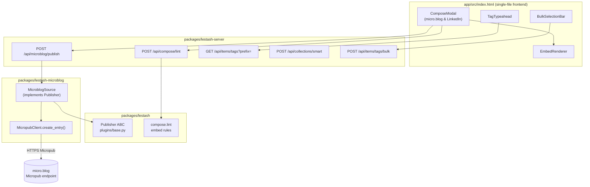
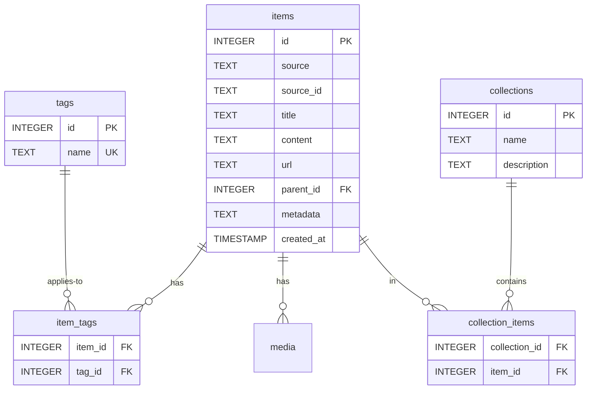
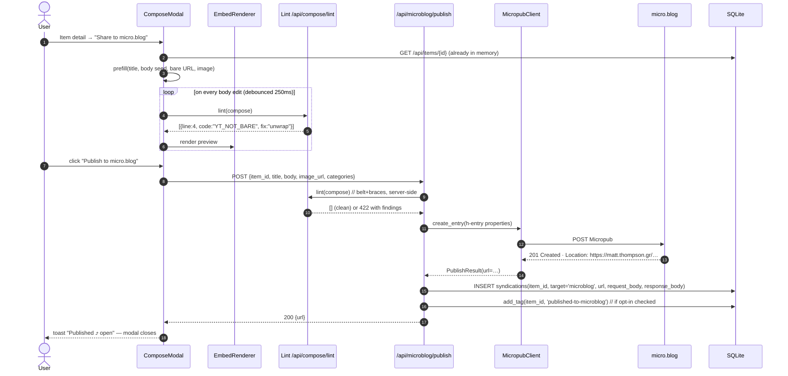
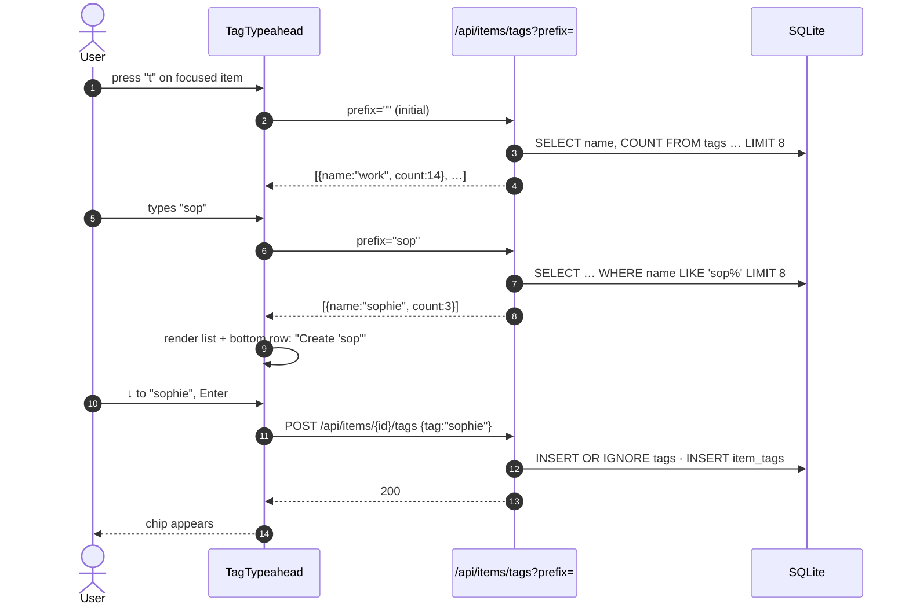
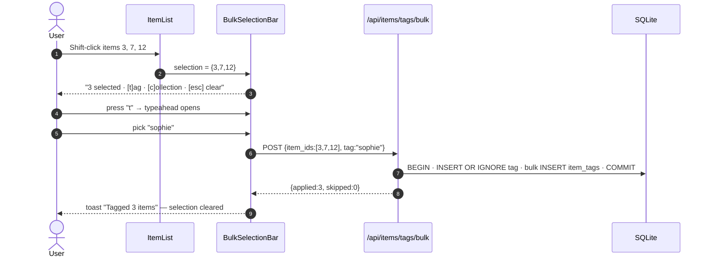
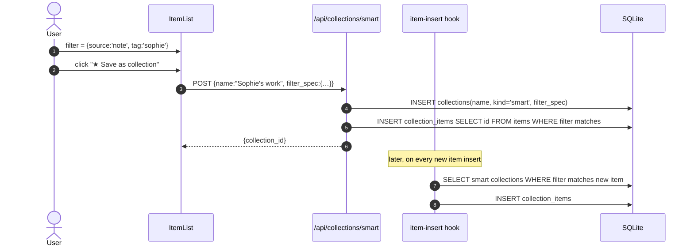

# UX Architecture — Compose, Embed, Categorize

> Status: design draft · 2026-05-30 · author: Matt + Claude
> Scope: micro.blog compose flow, YouTube/LinkedIn embed handling, fast category creation
> Test discipline: Canon TDD — see [§7](#7-interfaces-canon-tdd)

---

## 1. Goals

Three concrete user jobs, each currently friction-heavy or unsupported:

1. **Re-publish a saved item to my micro.blog.** Take a LinkedIn post or YouTube video I've already liked + saved into LeStash, add my own framing, publish it. Today: no publish path exists — micro.blog plugin is read-only.
2. **Render the YouTube link the way micro.blog wants it.** The `spacex-ipo-imminent` post shows a `[youtu.be/-X6YzlY…](…)` markdown link. micro.blog will auto-embed a bare YouTube URL on its own line, but won't embed a wrapped markdown link. The compose flow should produce the embed-friendly form.
3. **Create a category fast and put items in it.** "Sophie's work" should take seconds, not a tag-input-per-item ritual. Today: no autocomplete, no bulk-tag, no save-this-filter-as-category.

A non-goal here: replacing collections with tags or vice versa. They earn their separate keep (see [§5.2](#52-tags-vs-collections)).

---

## 2. Today — what we have

### 2.1 Surface map (verified by reading)

| Concern | Where | State |
| --- | --- | --- |
| Item list | `app/src/index.html:2207-2248` · `/api/items` | Paginated 20, "Load more" |
| Item detail | `app/src/index.html:1563-2176` | Markdown + media gallery + tags |
| Tags on item | `app/src/index.html:1655-1666` · `POST /api/items/{id}/tags` | Add by typing; remove `×`; **no autocomplete** |
| Tags global | `routes/items.py:375` `GET /api/items/tags` | Lists tags w/ counts (used in filter dropdown) |
| Collections | `app/src/index.html:3852-3939` · `/api/collections` | Modal create, manual add |
| LinkedIn publish | `app/src/index.html:3943-4063` · `/api/linkedin/post` | Works — proves the publish pattern |
| micro.blog publish | — | **Missing** |
| Share/capture | `app/src/index.html:3070-3168` | URL ingest + YouTube transcript fetch |
| Bear-style notes | `Notes` tab | Voice + text |

### 2.2 The example, decoded

`https://matt.thompson.gr/2026/05/30/spacex-ipo-imminent.html` rendered as:

```markdown


…body prose…

[youtu.be/-X6YzlY…](https://youtu.be/-X6YzlY_8tM?is=i1Qr7bQuRiXhd9-G)
```

The blog has the [`micro-blog-lite-youtube`](https://github.com/rknightuk/micro-blog-lite-youtube) plugin installed — see §2.4. That plugin scans every rendered `<a href>` for a YouTube URL and appends a `<lite-youtube videoid="…">` at the end of the post. Wrapping in `[]()` is *not* the problem.

The problem is the **trailing `?is=…` tracking parameter**. The plugin's video-ID regex captures everything after the slash as non-whitespace, so `videoid` gets set to `-X6YzlY_8tM?is=i1Qr7bQuRiXhd9-G`. The lite-youtube web component then builds an embed URL like `…/embed/-X6YzlY_8tM?is=…?autoplay=…` — two `?` characters, malformed, YouTube returns nothing.

Fix in the compose pipeline: **strip YouTube query params and normalise to `https://youtu.be/<id>`** before publish. The lint rule isn't `YT_NOT_BARE`, it's `YT_TRACKING_PARAM`.

### 2.4 The rknightuk plugin (installed)

[`micro-blog-lite-youtube`](https://github.com/rknightuk/micro-blog-lite-youtube) is a Hugo partial that ships JS + CSS to every page. On `DOMContentLoaded`:

```js
const links = [...p.getElementsByTagName('a')]
links.forEach(l => {
  const m = l.href.match(/…(youtube.com|youtu.be)\/(watch|embed)?(\?v=|\/)?(\S+)?/)
  const ytId = m ? m[7] : null
  if (ytId && article) {
    const video = document.createElement('lite-youtube')
    video.setAttribute('videoid', ytId)
    article.appendChild(video)
  }
})
```

Three behaviours that shape our design:

| Behaviour | Implication for compose |
| --- | --- |
| Matches **any** `<a href>` with youtube.com / youtu.be | Wrapped `[label](url)` markdown links are fine — no need to force bare URLs |
| Appends embeds **at the end of `.post-content`**, not inline | The link's text position is purely visual; the player will always be at the bottom |
| Regex captures rest-of-URL into video ID | Tracking params (`?si=`, `?is=`, `&t=`, etc.) break the embed silently |

What this means for the architecture:

- **No `YT_NOT_BARE` lint.** Replaced by `YT_TRACKING_PARAM` (warn + offer normalise).
- **Compose doesn't need to render YouTube embeds for "WYSIWYG parity with micro.blog"** — the rknightuk plugin owns that. LeStash's own EmbedRenderer (§3.3, §7.4) is still useful inside the LeStash detail view, but its output doesn't need to match micro.blog's rendered HTML, only its *intent*.
- **One open question** — see §8.7 — should we also send a fix upstream to rknightuk so the regex strips query strings? Independent of our compose-side fix, it would help others.

### 2.3 Capability gaps (the short list)

- `MicropubClient` has no `create_entry()` — read-only.
- `SourcePlugin` base class has no `publish()` contract — every publisher (LinkedIn, future micro.blog) reinvents it.
- No "compose from existing item" flow. The share modal goes inbound only.
- No tag autocomplete; no bulk-tag selection.
- No "save current filter as a category."
- No CLI tag commands (precludes batch grooming).

---

## 3. Proposed UX

Three flows, each kept narrow on purpose.

### 3.1 Compose-from-item

**Entry points (all open the same composer with the item pre-loaded):**

- Item detail → `Share to micro.blog` button next to existing `Share to LinkedIn`.
- Keyboard: `m` on a focused item card or in detail view.
- Right-click / long-press on an item card → `Publish… → micro.blog`.

**Composer modal** (mirrors LinkedIn composer for muscle memory):

```
┌──────────────────────────────────────────────────────────┐
│  Publish to micro.blog                              [✕]  │
├──────────────────────────────────────────────────────────┤
│  Title  ┌─────────────────────────────────────────────┐  │
│         │ SpaceX IPO imminent                         │  │
│         └─────────────────────────────────────────────┘  │
│  Body   ┌─────────────────────────────────────────────┐  │
│         │ Reusable rockets, satellite comms, and the  │  │
│         │ AI-hype refrain.                            │  │
│         │                                             │  │
│         │ https://youtu.be/-X6YzlY_8tM    ⟵ bare URL  │  │
│         │                                  auto-embeds│  │
│         └─────────────────────────────────────────────┘  │
│  Image  [thumb] screenshot-20260530.png   [Remove]       │
│  Tags   ⊞ spacex   ⊞ ipo                                 │
│  Cats   ⊞ tech-watch   [+ add]                           │
│  Visibility: ● Public  ○ Draft                           │
│                                                          │
│  ☑ Save syndication link back to source item             │
│  ☑ Tag source item as "published-to-microblog"           │
│                                                          │
│  Preview ─────────────────────────────────────  [Open ⤴] │
│                                                          │
│             [Cancel]              [Publish to micro.blog]│
└──────────────────────────────────────────────────────────┘
```

**Pre-fill rules**, ordered by source kind. "Canonical YT URL" = `https://youtu.be/<id>` with no query string (see §2.4):

| Source | Title | Body seed | Link form | Image |
| --- | --- | --- | --- | --- |
| YouTube | video title | empty (cursor here) + blank line + `[<title>](<canonical YT URL>)` | canonical YT URL | thumbnail (optional) |
| LinkedIn | first 80 chars of post or empty | `> …quote…` blockquote + blank line + source link | source URL | first attached image |
| Bluesky | empty | `> …quote…` + source link | source URL | attached image |
| arXiv | paper title | `> abstract…` + source link | source URL | (none) |
| micro.blog (reshare) | original title | `> …quote…` + source link | source URL | first photo |
| Note (own) | first line | rest of body | (none) | (none) |

The composer never silently strips formatting — what you see is what gets POSTed. The one exception: tracking params on known-fragile URLs (YouTube) are stripped at prefill time, and shown in the lint panel as `info` so the user sees what happened.

**Embed-rule guard.** A lint pass on the body, surfaced inline:

- `ℹ Line 4: stripped tracking param ?is=…G from YouTube URL (rknightuk plugin needs a clean ID).`
- `⚠ Line 6: YouTube URL with query string — embed will break. [Normalise]`
- `⚠ Image referenced as ; micro.blog prefers  markdown.`

One-click "fix" for each warning. No silent rewrites — even the prefill-time strip is surfaced as `info` so the user can revert it (e.g. if the param matters for an unlisted/private link).

### 3.2 Quick-category

The "Sophie's work" path should be one of:

**Path A — from filtered list ("save this filter"):**

1. Apply `source = note` + `tag = sophie` filter on Recent.
2. Click `★ Save as collection` (new button next to Load more).
3. Name it "Sophie's work" → all matching items auto-added; future items matching saved filter auto-added too (smart collection).

**Path B — from item detail:**

1. On any item, press `t` → tag input with **typeahead** opens (existing tags first, "Create new tag '…'" at bottom).
2. Type "sop" → see `sophie`, `sophies-work`, or "Create new tag 'sophies-work'" — picking creates and assigns in one action.

**Path C — bulk-tag from list:**

1. Hold `Shift` and click items to multi-select (selection chip count appears at bottom).
2. Press `t` → tag input with typeahead applies to all selected.

**Why three:** A is for "this filter is meaningful, persist it"; B is for "this one item belongs here"; C is for "I just realised five items belong here." Each is one of the three real moves.

### 3.3 Embed-aware rendering in LeStash

micro.blog handles its own rendering via the rknightuk plugin (§2.4). LeStash still benefits from showing the same intent inside its own UI:

- **Item detail body**: detect YouTube URLs in any form → render lazy iframe (no-cookie domain). Saves a click vs. opening youtube.com.
- **Compose preview**: render the *cleaned* body — what micro.blog will receive — so the user can verify the URL normalisation took effect.
- One renderer module shared between detail view + compose preview + (future) feed cards. See [§7.4](#74-embedrenderer).

Crucially, LeStash's renderer doesn't need to *match* micro.blog's rendered HTML byte-for-byte — that's the rknightuk plugin's job downstream. It just needs to show the user what they're publishing without surprises.

---

## 4. Architecture

### 4.1 Component diagram



### 4.2 Plugin contract — Publisher

New abstract base, opt-in per plugin. LinkedIn migrates to it; micro.blog implements it from day one.

```python
class Publisher(Protocol):
    """Optional companion to SourcePlugin — plugin can post outbound."""

    async def publish(
        self,
        item: Item,                       # the source item
        compose: ComposeRequest,          # user-edited title/body/etc.
    ) -> PublishResult: ...

    def lint(
        self,
        compose: ComposeRequest,
    ) -> list[LintFinding]: ...           # called pre-publish + for live preview
```

A plugin can be `SourcePlugin & Publisher`, `SourcePlugin` only, or `Publisher` only.

### 4.3 What sits in core vs. plugin

- **Core**: `Publisher` Protocol, `ComposeRequest` / `PublishResult` / `LintFinding` schemas, the dispatcher that maps `target=microblog|linkedin` to a registered Publisher, server routes.
- **Plugin (microblog)**: Micropub call, h-entry property mapping, micro.blog-specific lint rules (bare-URL embed rule, image preference rule, character soft-limit).
- **Plugin (linkedin)**: stays where it is, gains `Publisher` conformance.

---

## 5. Data schema

### 5.1 Existing (verified)



### 5.2 Tags vs. collections — keep both

- **Tags**: lightweight, many-per-item, faceted filter. "spacex", "ipo", "watched".
- **Collections**: named, curated, ordered set. "Sophie's work", "Q2-review reading list". Can be public-named, exported, shared.
- A **smart collection** (new) is a collection whose membership is computed from a filter spec, and recomputed on item insert.

### 5.3 New tables

```sql
-- §3.1 round-trip: where did this item get republished to?
CREATE TABLE syndications (
  id              INTEGER PRIMARY KEY,
  item_id         INTEGER NOT NULL REFERENCES items(id) ON DELETE CASCADE,
  target          TEXT    NOT NULL,        -- 'microblog' | 'linkedin' | …
  target_url      TEXT    NOT NULL,        -- the published URL
  published_at    TIMESTAMP NOT NULL DEFAULT CURRENT_TIMESTAMP,
  request_body    TEXT,                    -- JSON ComposeRequest (audit trail)
  response_body   TEXT,                    -- raw provider response
  UNIQUE(item_id, target, target_url)
);
CREATE INDEX idx_syndications_item ON syndications(item_id);

-- §3.2 path A: smart collections (filter-driven)
ALTER TABLE collections ADD COLUMN kind TEXT NOT NULL DEFAULT 'manual';  -- 'manual' | 'smart'
ALTER TABLE collections ADD COLUMN filter_spec TEXT;                      -- JSON when kind='smart'
-- filter_spec example: {"source":"note","tag":"sophie","q":null,"own":true}
```

`syndications` lets the item detail show "Published to micro.blog ⤴" and prevents accidental double-posting. Storing `request_body` makes "re-publish with edits" trivially safe — we have the prior text.

### 5.4 Tag input — no schema change

Tag normalization is already lowercase; autocomplete just needs a `prefix=` query (small server change, see [§7.5](#75-tag-autocomplete-api)).

---

## 6. Sequence flows

### 6.1 Compose & publish a YouTube item to micro.blog



Notes on step 4 (lint findings): findings render inline (yellow underline + tooltip) rather than blocking submit. Submit is blocked only on `severity=error` — currently none of the embed rules are errors, all warnings.

### 6.2 Quick-tag with typeahead (Path B)



### 6.3 Bulk-tag (Path C)



### 6.4 Smart collection (Path A)



---

## 7. Interfaces (Canon TDD)

> Canon TDD's claim: "It's in the writing of this test that you'll begin making design decisions, but they are primarily interface decisions." Below: the test list first, then the interface that falls out of it.

### 7.1 Test list — `Publisher` Protocol

1. `publish()` on a fresh item returns a `PublishResult` with a non-empty URL.
2. `publish()` records a `syndications` row keyed by `(item_id, target, target_url)`.
3. `publish()` twice with same body is **not** automatically idempotent — caller must opt-in via `if_not_already_published=True`; default raises `AlreadyPublished` to surface the choice.
4. `publish()` failure (5xx from provider) leaves no `syndications` row, raises `PublishFailed` with the provider response attached.
5. `publish()` failure (4xx with body) raises `PublishRejected` with provider message — caller shows it to user verbatim.
6. `lint()` on a body with `https://youtu.be/X` (clean) returns no YouTube findings.
7. `lint()` on a body with `https://youtu.be/X?si=abc` returns one `YT_TRACKING_PARAM` finding, with `fix_hint` containing the normalised URL `https://youtu.be/X`.
8. `lint()` on a body with `https://www.youtube.com/watch?v=X&t=30` returns `YT_TRACKING_PARAM` (the `&t=30` breaks the rknightuk regex), `fix_hint` proposes `https://youtu.be/X`.
9. `lint()` on a body with `[label](https://youtu.be/X?si=abc)` returns `YT_TRACKING_PARAM` — the lint walks anchor hrefs too, since that's what the rknightuk plugin inspects.
10. `lint()` on a body with an `` returns `IMG_NOT_MARKDOWN`.
11. `lint()` is pure — no IO, no network.

### 7.2 Interface that falls out

```python
# packages/lestash/src/lestash/plugins/publisher.py
from __future__ import annotations
from dataclasses import dataclass
from typing import Protocol, Literal

LintCode = Literal[
    "YT_TRACKING_PARAM",   # query string on YouTube URL breaks rknightuk plugin
    "IMG_NOT_MARKDOWN",
    "SOFT_CHAR_LIMIT",
]
Severity = Literal["info", "warn", "error"]

@dataclass(frozen=True)
class ComposeRequest:
    item_id: int
    title: str | None
    body: str
    image_url: str | None
    categories: tuple[str, ...]
    visibility: Literal["public", "draft"] = "public"

@dataclass(frozen=True)
class LintFinding:
    line: int                 # 1-indexed
    col: int                  # 1-indexed; 0 = whole line
    code: LintCode
    severity: Severity
    message: str
    fix_hint: str | None      # e.g. "unwrap markdown link to bare URL"

@dataclass(frozen=True)
class PublishResult:
    url: str
    target: str               # 'microblog' | 'linkedin' | …
    raw_response: dict

class AlreadyPublished(Exception): ...
class PublishRejected(Exception):  # 4xx
    def __init__(self, message: str, raw: dict) -> None: ...
class PublishFailed(Exception):    # 5xx / network
    def __init__(self, message: str, raw: dict | None) -> None: ...

class Publisher(Protocol):
    target: str

    def lint(self, compose: ComposeRequest) -> list[LintFinding]: ...

    async def publish(
        self,
        compose: ComposeRequest,
        *,
        if_not_already_published: bool = False,
    ) -> PublishResult: ...
```

Notice what the test list forced into the interface:

- **`lint` is sync + pure** (tests 6–11) — no `async`, no IO. Pure function, trivial to unit-test, can run on every keystroke.
- **`fix_hint` carries a concrete replacement** (tests 7–9) — not just "fix this", but "replace with `<this>`". The UI's one-click fix is then a string replace, no extra logic in the frontend.
- **`lint` walks anchor hrefs, not just bare URLs** (test 9) — mirrors what the rknightuk plugin inspects. The test forces this.
- **Three distinct exception classes** (tests 3–5) — collapsing them to one `PublishError` would lose the calling-code distinctions the tests already require (re-publish flag, show-to-user, retry).
- **`if_not_already_published` is an explicit boolean** (test 3) — not a global config, not implicit-by-default. The default surfaces the decision.
- **`raw_response` returned** (test 1+2) — so the route can store it in `syndications.response_body` without the Publisher having to know about the DB.

### 7.3 Test list — `TagTypeahead` (server side)

1. `GET /api/items/tags?prefix=` (empty) returns top 8 tags by count, descending.
2. `GET /api/items/tags?prefix=sop` returns tags starting with `sop`, case-insensitive, by count desc.
3. Tag names are normalized to lowercase before comparison — `prefix=SOP` matches `sophie`.
4. `prefix` with SQL wildcards (`%`, `_`) is treated as literal — no injection.
5. Response includes a `total` field so the UI can show "+12 more".
6. Empty result returns `[]` with HTTP 200, not 404.
7. `limit` query param caps results, max 50, default 8.

### 7.4 `EmbedRenderer`

Scope: LeStash detail view + compose preview only. The rknightuk plugin owns rendering on micro.blog. We're showing the user what they *intend* to publish.

Test list:

1. `render("https://youtu.be/X")` returns an `<iframe>` with `youtube-nocookie.com` host.
2. `render("[label](https://youtu.be/X)")` *also* renders the embed (matches rknightuk plugin behaviour — anchor hrefs are detected).
3. `render("https://www.youtube.com/watch?v=X")` and `render("https://youtu.be/X")` produce the same embed.
4. `render("https://youtu.be/X?si=abc")` produces an embed for ID `X` — query strings ignored at render time (defensive). The lint pass still flags it so the user is aware.
5. Multiple YouTube URLs in one body → multiple embeds, appended at end of body (matches rknightuk's append-at-end semantics).
6. `render` is sync, pure, no fetch.
7. `render` escapes user content in surrounding text — no XSS.
8. Unknown video host falls back to plain `<a>`.

Interface:

```ts
// app/src/embed.ts (extracted from index.html)
export type EmbedRenderResult = { html: string; embedsUsed: string[] };
export function renderBodyToHtml(body: string): EmbedRenderResult;
export function detectEmbeds(body: string): Array<{ line: number; url: string; provider: 'youtube' | 'vimeo' | null }>;
```

`embedsUsed` lets the composer preview show "1 YouTube embed" and the lint pass cross-check intent vs reality.

### 7.5 Tag autocomplete API

```
GET /api/items/tags?prefix=<str>&limit=<int>
→ 200 { results: [{name, count}], total: int }
```

### 7.6 Bulk-tag API

Test list:

1. POST with `item_ids=[]` returns 400.
2. POST with valid ids creates one tag row (if new), and N `item_tags` rows.
3. Items already tagged are counted in `skipped`, not `applied`.
4. Non-existent item ids are reported in `not_found`, transaction still commits for the rest.
5. Operation is atomic per request — partial DB writes never persist on exception.

Interface:

```
POST /api/items/tags/bulk
  body: { item_ids: int[], tag: string }
  → 200 { applied: int, skipped: int, not_found: int[] }
```

### 7.7 Smart collection — minimal first pass

Test list:

1. Creating a smart collection with `filter_spec={source:'note', tag:'sophie'}` snapshots matching items into `collection_items`.
2. Inserting a new item that matches the filter appends it to the smart collection (via hook).
3. Inserting a new item that does not match is ignored.
4. Editing a tag off an item does **not** remove it from a smart collection (snapshot semantics — explicit). Document this clearly; revisit if it bites.
5. Deleting a smart collection drops its rows but does not delete items.

Why snapshot semantics in test 4: live "view" semantics would require running the filter on every read and would couple smart collections to filter-spec versioning. Snapshot keeps the schema flat and the behaviour predictable; the user can always re-save the filter.

---

## 8. Open questions / decisions to make

1. **Where do credentials for "post to *which* micro.blog blog" live?** Today `mp-destination` is settable in sync (multi-blog). Composer should expose a destination picker if >1 blog detected at auth time. → Default: detect; show picker only when ambiguous.
2. **Draft vs publish.** Micropub supports `post-status=draft`. UI exposes this as visibility radio. → Yes, ship from day one (low cost, lets user proof).
3. **Image upload path.** micro.blog config advertises a `media-endpoint`. For initial slice: only support items whose `media[0]` is already a URL we can pass through; defer multipart upload to v2. → Documented limit in composer ("Local images coming soon").
4. **Tag normalization on autocomplete.** Show `sophies-work` and `sophie work` as separate? They *are* separate today. → Add a "suggest merge?" hint when prefix matches multiple near-duplicates (`Levenshtein ≤ 2`). Defer the actual merge UI; surface the smell.
5. **`lint` rule extensibility.** Per-target rule sets or one shared set? → One shared set lives in core; targets opt in by listing codes. micro.blog opts into `YT_TRACKING_PARAM`, `IMG_NOT_MARKDOWN`, `SOFT_CHAR_LIMIT(300)`. LinkedIn opts into `SOFT_CHAR_LIMIT(3000)` only.
6. **Two-app pattern (project memory: LinkedIn dual-app, see [[project_linkedin_posting]]):** does micro.blog need anything similar? → No. Single app token, single endpoint. Simpler.
7. **Upstream fix to rknightuk plugin?** The video-ID regex (§2.4) captures query strings into the ID. We work around it by stripping client-side; a one-line regex fix upstream would help anyone using the plugin. → Open a PR to `rknightuk/micro-blog-lite-youtube` proposing `match(/…\/(?:watch\?v=|embed\/)?([^?&\s]+)/)`. Independent of our compose-side fix; both belt and braces.

---

## 9. Roadmap — small, shippable slices

Each slice is independently mergeable + demo-able. PR titles in the suggested commit style.

| # | Slice | Slice value | Touches |
| - | --- | --- | --- |
| 1 | `feat(lestash): add Publisher protocol + ComposeRequest/PublishResult/LintFinding schemas` | Foundation; no user-visible change | `packages/lestash` |
| 2 | `feat(microblog): implement MicropubClient.create_entry()` | Backend can post; tested via CLI | `lestash-microblog` |
| 3 | `feat(microblog): expose POST /api/microblog/publish` | API-first publish | `lestash-server` |
| 4 | `feat(app): micro.blog compose modal (YouTube prefill)` | First end-to-end user flow | `app/` |
| 5 | `feat(lestash): compose.lint with YT_NOT_BARE + IMG_NOT_MARKDOWN` | Embed warnings | `packages/lestash` |
| 6 | `feat(app): EmbedRenderer extraction + iframe rendering in detail view` | YouTube embeds everywhere | `app/` |
| 7 | `feat(server): GET /api/items/tags?prefix=` | Autocomplete backend | `lestash-server` |
| 8 | `feat(app): TagTypeahead + "t" shortcut` | Path B faster tag | `app/` |
| 9 | `feat(server): POST /api/items/tags/bulk` | Bulk endpoint | `lestash-server` |
| 10 | `feat(app): bulk selection bar (Shift-click)` | Path C bulk | `app/` |
| 11 | `feat(server): smart collections (kind=smart, filter_spec)` | Path A persistence | `lestash-server` |
| 12 | `feat(app): "Save filter as collection" button` | Path A surface | `app/` |
| 13 | `feat(microblog): LinkedIn migrates to Publisher protocol` | Consolidation; deletes dup code | `lestash-linkedin` |
| 14 | `feat(microblog): draft visibility + destination picker` | Polish | `lestash-microblog`, `app/` |

Slices 1–4 unlock the SpaceX-IPO use case. Slices 7–10 unlock the Sophie's-work use case. Slice 5–6 fix the YouTube-link bug. Each is its own PR, each has its own test list before code.

---

## 10. What this design deliberately leaves out

- Local image upload to micro.blog media-endpoint (v2).
- Cross-target compose ("publish to both micro.blog AND LinkedIn in one click") — additive later.
- Reading own micro.blog posts from `syndications` table to build a back-link feed.
- A WYSIWYG editor — markdown stays the substrate, preview is the live render.
- Categories *as a third concept* on top of tags + collections — keeps the model small.
- AI-assisted body drafting from item content — separate design.
