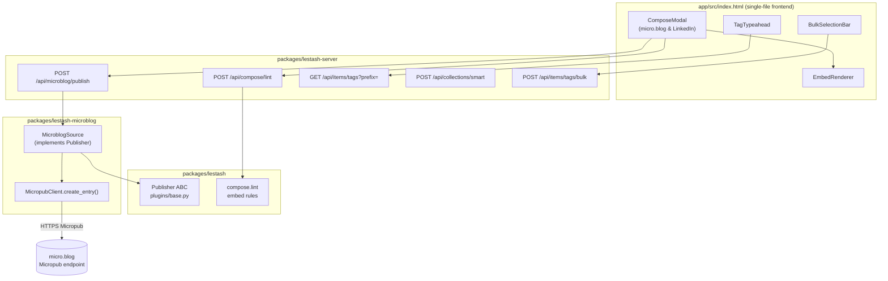
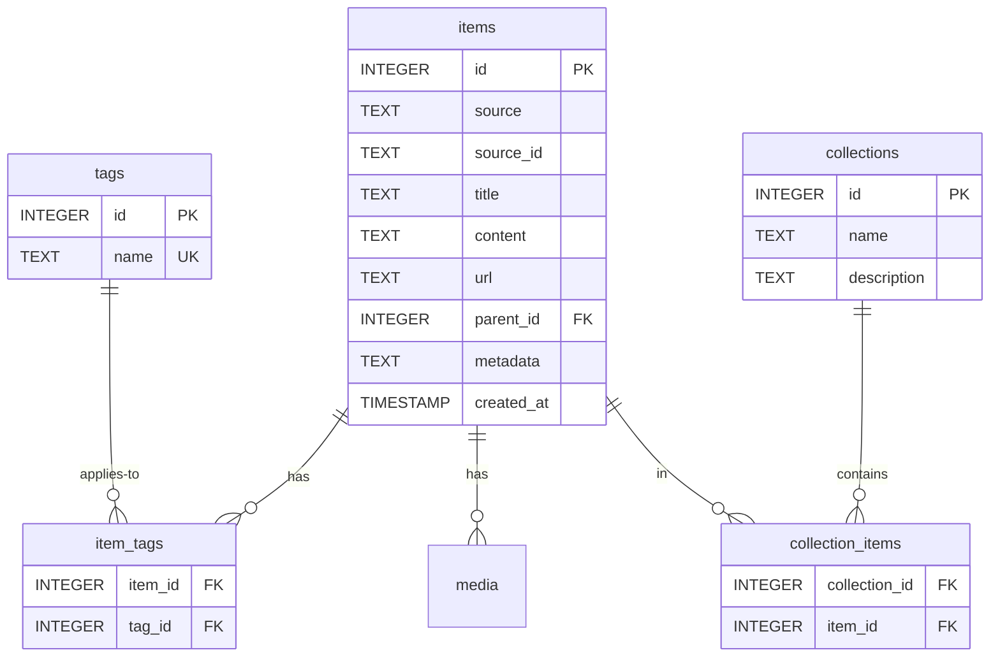
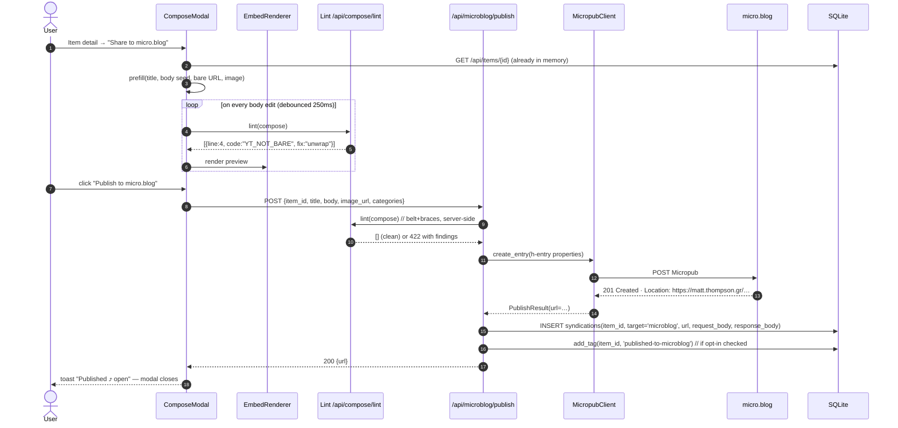
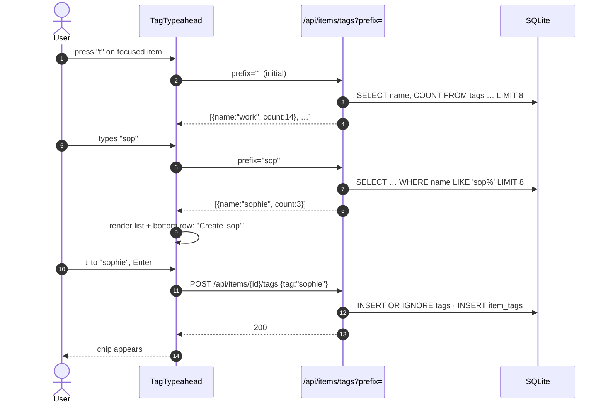
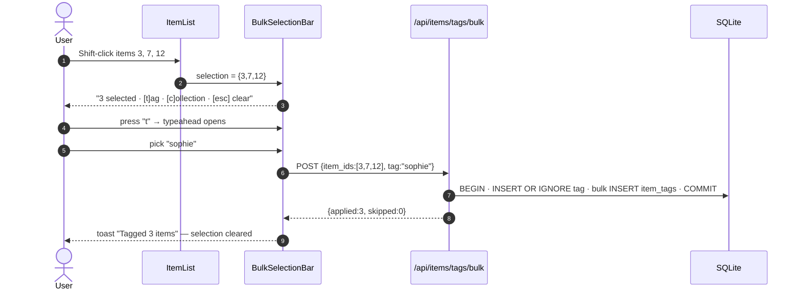
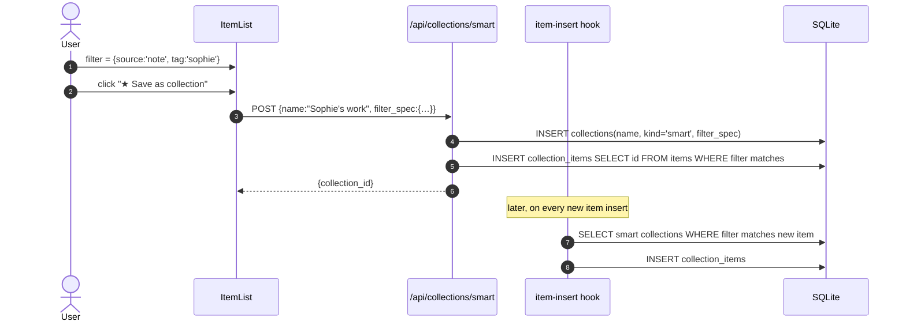
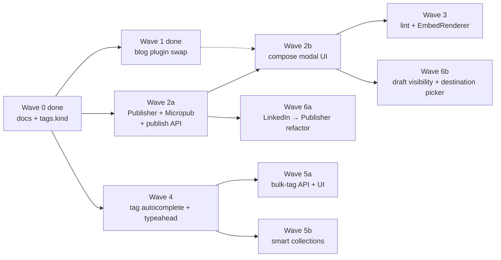

# UX Architecture — Compose, Embed, Categorize

> Status: design draft · 2026-05-30 · author: Matt + Claude
> Scope: micro.blog compose flow, YouTube/LinkedIn embed handling, fast category creation
> Test discipline: Canon TDD — see [§7](#7-interfaces-canon-tdd)

---

## 1. Goals

Three concrete user jobs, each currently friction-heavy or unsupported:

1. **Re-publish a saved item to my micro.blog.** Take a LinkedIn post or YouTube video I've already liked + saved into LeStash, add my own framing, publish it. Today: no publish path exists — micro.blog plugin is read-only.
2. **Render the YouTube link the way micro.blog wants it.** The `spacex-ipo-imminent` post shows a `[youtu.be/-X6YzlY…](…)` markdown link. micro.blog will auto-embed a bare YouTube URL on its own line, but won't embed a wrapped markdown link. The compose flow should produce the embed-friendly form.
3. **Create a category fast and put items in it.** "Sophie's work" should take seconds, not a tag-input-per-item ritual. Today: no autocomplete, no bulk-tag, no save-this-filter-as-category.

A non-goal here: replacing collections with tags or vice versa. They earn their separate keep (see [§5.2](#52-tags-vs-collections)).

---

## 2. Today — what we have

### 2.1 Surface map (verified by reading)

| Concern | Where | State |
| --- | --- | --- |
| Item list | `app/src/index.html:2207-2248` · `/api/items` | Paginated 20, "Load more" |
| Item detail | `app/src/index.html:1563-2176` | Markdown + media gallery + tags |
| Tags on item | `app/src/index.html:1655-1666` · `POST /api/items/{id}/tags` | Add by typing; remove `×`; **no autocomplete** |
| Tags global | `routes/items.py:375` `GET /api/items/tags` | Lists tags w/ counts (used in filter dropdown) |
| Collections | `app/src/index.html:3852-3939` · `/api/collections` | Modal create, manual add |
| LinkedIn publish | `app/src/index.html:3943-4063` · `/api/linkedin/post` | Works — proves the publish pattern |
| micro.blog publish | — | **Missing** |
| Share/capture | `app/src/index.html:3070-3168` | URL ingest + YouTube transcript fetch |
| Bear-style notes | `Notes` tab | Voice + text |

### 2.2 The example, decoded

`https://matt.thompson.gr/2026/05/30/spacex-ipo-imminent.html` rendered as:

```markdown


…body prose…

[youtu.be/-X6YzlY…](https://youtu.be/-X6YzlY_8tM?is=i1Qr7bQuRiXhd9-G)
```

The link was emitted as a markdown anchor with a `?is=…` tracking parameter. On the SpaceX post that rendered to anchor-only — no embed. After comparing the available micro.blog YouTube plugins (see §2.4), this design targets [`flschr/mbplugin-youtube-nocookie`](https://github.com/flschr/mbplugin-youtube-nocookie). That plugin doesn't take URLs at all — it takes a Hugo shortcode `` and emits a build-time, no-cookie, lazy-loaded embed inline.

Fix in the compose pipeline: **extract the 11-char video ID and emit ``** rather than a raw URL or a markdown link. The whole "did the URL keep a tracking param" class of failure disappears because the shortcode only accepts IDs.

### 2.4 Plugin choice — flschr over rknightuk

The blog currently runs [`rknightuk/micro-blog-lite-youtube`](https://github.com/rknightuk/micro-blog-lite-youtube). This design targets [`flschr/mbplugin-youtube-nocookie`](https://github.com/flschr/mbplugin-youtube-nocookie) instead — install swap recommended.

| Dimension | rknightuk (today) | flschr (target) |
| --- | --- | --- |
| Trigger | runtime JS body scan for `<a href>` | Hugo shortcode `` |
| Render moment | browser runtime | **build-time** (HTML + small inline JS) |
| Input form | URL (regex-parsed, fragile) | **11-char ID only** (v1.3.5 dropped URL parsing for "instability") |
| Position | appended to end of `.post-content` | **inline** at shortcode site |
| Privacy | `youtube.com` | `youtube-nocookie.com` |
| RSS / Mastodon | empty — JS doesn't run in feed readers | iframe + `.yt-text-link` text fallback |
| Tracking-param failure | `?si=` / `?is=` silently breaks the embed | structurally impossible (input is ID, not URL) |
| Lazy load | yes (lite-yt-embed via CDN) | yes (thumbnail + click-to-play, no CDN) |

What this means for the architecture:

- **`YT_TRACKING_PARAM` lint — deleted.** The class of failure doesn't exist when input is an ID.
- **EmbedRenderer's compose-side job becomes URL→ID extraction** — parse any of `youtu.be/<id>`, `youtube.com/watch?v=<id>`, `youtube.com/embed/<id>`, `m.youtube.com/…`, `youtube-nocookie.com/embed/<id>`, plus `?list=<id>` playlists — and emit `` (optionally `` for the 3rd-arg title used in aria-label, iframe title, and the feed fallback link).
- **EmbedRenderer's LeStash-side job (preview / detail-view rendering) unchanged in intent** — render an inline embed so the user sees what they're publishing. It can render an `<iframe>` directly; doesn't need to mimic flschr's button-thumbnail-then-iframe UX.
- **Status**: done (2026-06-05). flschr installed, rknightuk removed. See §9 slice 0.

### 2.3 Capability gaps (the short list)

- `MicropubClient` has no `create_entry()` — read-only.
- `SourcePlugin` base class has no `publish()` contract — every publisher (LinkedIn, future micro.blog) reinvents it.
- No "compose from existing item" flow. The share modal goes inbound only.
- No tag autocomplete; no bulk-tag selection.
- No "save current filter as a category."
- No CLI tag commands (precludes batch grooming).

---

## 3. Proposed UX

Three flows, each kept narrow on purpose.

### 3.1 Compose-from-item

**Entry points (all open the same composer with the item pre-loaded):**

- Item detail → `Share to micro.blog` button next to existing `Share to LinkedIn`.
- Keyboard: `m` on a focused item card or in detail view.
- Right-click / long-press on an item card → `Publish… → micro.blog`.

**Composer modal** (mirrors LinkedIn composer for muscle memory):

```
┌──────────────────────────────────────────────────────────┐
│  Publish to micro.blog                              [✕]  │
├──────────────────────────────────────────────────────────┤
│  Title  ┌─────────────────────────────────────────────┐  │
│         │ SpaceX IPO imminent                         │  │
│         └─────────────────────────────────────────────┘  │
│  Body   ┌─────────────────────────────────────────────┐  │
│         │ Reusable rockets, satellite comms, and the  │  │
│         │ AI-hype refrain.                            │  │
│         │                                             │  │
│         │     │  │
│         │            ⟵ flschr shortcode (build-time)  │  │
│         └─────────────────────────────────────────────┘  │
│  Image  [thumb] screenshot-20260530.png   [Remove]       │
│  Tags   ⊞ spacex   ⊞ ipo                                 │
│  Cats   ⊞ tech-watch   [+ add]                           │
│  Visibility: ● Public  ○ Draft                           │
│                                                          │
│  ☑ Save syndication link back to source item             │
│  ☑ Tag source item as "published-to-microblog"           │
│                                                          │
│  Preview ─────────────────────────────────────  [Open ⤴] │
│                                                          │
│             [Cancel]              [Publish to micro.blog]│
└──────────────────────────────────────────────────────────┘
```

**Pre-fill rules**, ordered by source kind:

| Source | Title | Body seed | Embed form | Image |
| --- | --- | --- | --- | --- |
| YouTube | video title | empty (cursor here) + blank line + `` | flschr shortcode | thumbnail (optional, the shortcode renders one) |
| LinkedIn | first 80 chars of post or empty | `> …quote…` blockquote + blank line + source link | bare link | first attached image |
| Bluesky | empty | `> …quote…` + source link | bare link | attached image |
| arXiv | paper title | `> abstract…` + source link | bare link | (none) |
| micro.blog (reshare) | original title | `> …quote…` + source link | bare link | first photo |
| Note (own) | first line | rest of body | (none) | (none) |

The composer never silently strips formatting — what you see is what gets POSTed. YouTube prefill resolves the source URL to its video ID at prefill time, and the lint panel shows what was extracted (`ℹ extracted videoid "-X6YzlY_8tM" from saved URL`).

**Embed-rule guard.** A lint pass on the body, surfaced inline:

- `ℹ Line 4: extracted videoid "-X6YzlY_8tM" from saved URL — shortcode  will embed at build time.`
- `⚠ Line 6: raw YouTube URL detected — the flschr plugin only embeds via shortcode. [Convert to ]`
- `⚠ Image referenced as ; micro.blog prefers  markdown.`

One-click "fix" for each warning. No silent rewrites.

### 3.2 Quick-category

The "Sophie's work" path should be one of:

**Path A — from filtered list ("save this filter"):**

1. Apply `source = note` + `tag = sophie` filter on Recent.
2. Click `★ Save as collection` (new button next to Load more).
3. Name it "Sophie's work" → all matching items auto-added; future items matching saved filter auto-added too (smart collection).

**Path B — from item detail:**

1. On any item, press `t` → tag input with **typeahead** opens (existing tags first, "Create new tag '…'" at bottom).
2. Type "sop" → see `sophie`, `sophies-work`, or "Create new tag 'sophies-work'" — picking creates and assigns in one action.

**Path C — bulk-tag from list:**

1. Hold `Shift` and click items to multi-select (selection chip count appears at bottom).
2. Press `t` → tag input with typeahead applies to all selected.

**Why three:** A is for "this filter is meaningful, persist it"; B is for "this one item belongs here"; C is for "I just realised five items belong here." Each is one of the three real moves.

### 3.3 Embed-aware rendering in LeStash

micro.blog handles its own rendering via the rknightuk plugin (§2.4). LeStash still benefits from showing the same intent inside its own UI:

- **Item detail body**: detect YouTube URLs in any form → render lazy iframe (no-cookie domain). Saves a click vs. opening youtube.com.
- **Compose preview**: render the *cleaned* body — what micro.blog will receive — so the user can verify the URL normalisation took effect.
- One renderer module shared between detail view + compose preview + (future) feed cards. See [§7.4](#74-embedrenderer).

Crucially, LeStash's renderer doesn't need to *match* micro.blog's rendered HTML byte-for-byte — that's the rknightuk plugin's job downstream. It just needs to show the user what they're publishing without surprises.

---

## 4. Architecture

### 4.1 Component diagram



### 4.2 Plugin contract — Publisher

New abstract base, opt-in per plugin. LinkedIn migrates to it; micro.blog implements it from day one.

```python
class Publisher(Protocol):
    """Optional companion to SourcePlugin — plugin can post outbound."""

    async def publish(
        self,
        item: Item,                       # the source item
        compose: ComposeRequest,          # user-edited title/body/etc.
    ) -> PublishResult: ...

    def lint(
        self,
        compose: ComposeRequest,
    ) -> list[LintFinding]: ...           # called pre-publish + for live preview
```

A plugin can be `SourcePlugin & Publisher`, `SourcePlugin` only, or `Publisher` only.

### 4.3 What sits in core vs. plugin

- **Core**: `Publisher` Protocol, `ComposeRequest` / `PublishResult` / `LintFinding` schemas, the dispatcher that maps `target=microblog|linkedin` to a registered Publisher, server routes.
- **Plugin (microblog)**: Micropub call, h-entry property mapping, micro.blog-specific lint rules (bare-URL embed rule, image preference rule, character soft-limit).
- **Plugin (linkedin)**: stays where it is, gains `Publisher` conformance.

---

## 5. Data schema

### 5.1 Existing (verified)



### 5.2 Tags vs. collections — keep both

- **Tags**: lightweight, many-per-item, faceted filter. "spacex", "ipo", "watched".
- **Collections**: named, curated, ordered set. "Sophie's work", "Q2-review reading list". Can be public-named, exported, shared.
- A **smart collection** (new) is a collection whose membership is computed from a filter spec, and recomputed on item insert.

### 5.3 New tables

```sql
-- §3.1 round-trip: where did this item get republished to?
CREATE TABLE syndications (
  id              INTEGER PRIMARY KEY,
  item_id         INTEGER NOT NULL REFERENCES items(id) ON DELETE CASCADE,
  target          TEXT    NOT NULL,        -- 'microblog' | 'linkedin' | …
  target_url      TEXT    NOT NULL,        -- the published URL
  published_at    TIMESTAMP NOT NULL DEFAULT CURRENT_TIMESTAMP,
  request_body    TEXT,                    -- JSON ComposeRequest (audit trail)
  response_body   TEXT,                    -- raw provider response
  UNIQUE(item_id, target, target_url)
);
CREATE INDEX idx_syndications_item ON syndications(item_id);

-- §3.2 path A: smart collections (filter-driven)
ALTER TABLE collections ADD COLUMN kind TEXT NOT NULL DEFAULT 'manual';  -- 'manual' | 'smart'
ALTER TABLE collections ADD COLUMN filter_spec TEXT;                      -- JSON when kind='smart'
-- filter_spec example: {"source":"note","tag":"sophie","q":null,"own":true}
```

`syndications` lets the item detail show "Published to micro.blog ⤴" and prevents accidental double-posting. Storing `request_body` makes "re-publish with edits" trivially safe — we have the prior text.

### 5.4 Tag input — minimal schema change

```sql
-- migration 10: distinguish curated category tags from ad-hoc free tags
ALTER TABLE tags ADD COLUMN kind TEXT NOT NULL DEFAULT 'ad-hoc';
-- values: 'category' (curated, shown in composer Cats autocomplete)
--        | 'ad-hoc'   (free tags, shown in composer Tags autocomplete)
```

Tag normalization is already lowercase. Autocomplete uses a `prefix=` query + a `kind=` filter so the composer can ask for category candidates and tag candidates separately from the same endpoint (see [§7.5](#75-tag-autocomplete-api)).

The 11 categories from [`blog-categories-consolidation.md`](blog-categories-consolidation.md) are seeded into the live DB with `kind='category'`. Future renames / additions happen via the same UI affordance as any tag — there's no separate "categories admin" surface.

---

## 6. Sequence flows

### 6.1 Compose & publish a YouTube item to micro.blog



Notes on step 4 (lint findings): findings render inline (yellow underline + tooltip) rather than blocking submit. Submit is blocked only on `severity=error` — currently none of the embed rules are errors, all warnings.

### 6.2 Quick-tag with typeahead (Path B)



### 6.3 Bulk-tag (Path C)



### 6.4 Smart collection (Path A)



---

## 7. Interfaces (Canon TDD)

> Canon TDD's claim: "It's in the writing of this test that you'll begin making design decisions, but they are primarily interface decisions." Below: the test list first, then the interface that falls out of it.

### 7.1 Test list — `Publisher` Protocol

1. `publish()` on a fresh item returns a `PublishResult` with a non-empty URL.
2. `publish()` records a `syndications` row keyed by `(item_id, target, target_url)`.
3. `publish()` twice with same body is **not** automatically idempotent — caller must opt-in via `if_not_already_published=True`; default raises `AlreadyPublished` to surface the choice.
4. `publish()` failure (5xx from provider) leaves no `syndications` row, raises `PublishFailed` with the provider response attached.
5. `publish()` failure (4xx with body) raises `PublishRejected` with provider message — caller shows it to user verbatim.
6. `lint()` on a body with `` (clean shortcode) returns no YouTube findings.
7. `lint()` on a body with `https://youtu.be/X` returns one `YT_RAW_URL` finding, `fix_hint = ''`.
8. `lint()` on a body with `https://www.youtube.com/watch?v=X&t=30` returns `YT_RAW_URL`, `fix_hint = ''` — tracking params dropped during extraction.
9. `lint()` on a body with `[label](https://youtu.be/X?si=abc)` returns `YT_RAW_URL` with `fix_hint = ''` — anchor text is preserved as the title arg.
10. `lint()` on a body with `https://www.youtube.com/playlist?list=PLabc` returns `YT_RAW_URL`, `fix_hint = ''` — playlists ride the same shortcode.
11. `lint()` on a body with an `` returns `IMG_NOT_MARKDOWN`.
12. `lint()` is pure — no IO, no network.

### 7.2 Interface that falls out

```python
# packages/lestash/src/lestash/plugins/publisher.py
from __future__ import annotations
from dataclasses import dataclass
from typing import Protocol, Literal

LintCode = Literal[
    "YT_RAW_URL",          # raw URL where  shortcode is expected
    "IMG_NOT_MARKDOWN",
    "SOFT_CHAR_LIMIT",
]
Severity = Literal["info", "warn", "error"]

@dataclass(frozen=True)
class ComposeRequest:
    item_id: int
    title: str | None
    body: str
    image_url: str | None
    categories: tuple[str, ...]
    visibility: Literal["public", "draft"] = "public"

@dataclass(frozen=True)
class LintFinding:
    line: int                 # 1-indexed
    col: int                  # 1-indexed; 0 = whole line
    code: LintCode
    severity: Severity
    message: str
    fix_hint: str | None      # e.g. "unwrap markdown link to bare URL"

@dataclass(frozen=True)
class PublishResult:
    url: str
    target: str               # 'microblog' | 'linkedin' | …
    raw_response: dict

class AlreadyPublished(Exception): ...
class PublishRejected(Exception):  # 4xx
    def __init__(self, message: str, raw: dict) -> None: ...
class PublishFailed(Exception):    # 5xx / network
    def __init__(self, message: str, raw: dict | None) -> None: ...

class Publisher(Protocol):
    target: str

    def lint(self, compose: ComposeRequest) -> list[LintFinding]: ...

    async def publish(
        self,
        compose: ComposeRequest,
        *,
        if_not_already_published: bool = False,
    ) -> PublishResult: ...
```

Notice what the test list forced into the interface:

- **`lint` is sync + pure** (tests 6–12) — no `async`, no IO. Pure function, trivial to unit-test, can run on every keystroke.
- **`fix_hint` carries a concrete replacement** (tests 7–10) — not just "fix this", but "replace with `<this>`". The UI's one-click fix is then a string replace, no extra logic in the frontend.
- **`lint` walks anchor hrefs and preserves anchor text** (test 9) — the anchor's label becomes the shortcode's title arg, so the click-to-play button and feed fallback link carry it through.
- **Playlists share the shortcode** (test 10) — same lint code, same fix shape, no separate playlist machinery.
- **Three distinct exception classes** (tests 3–5) — collapsing them to one `PublishError` would lose the calling-code distinctions the tests already require (re-publish flag, show-to-user, retry).
- **`if_not_already_published` is an explicit boolean** (test 3) — not a global config, not implicit-by-default. The default surfaces the decision.
- **`raw_response` returned** (test 1+2) — so the route can store it in `syndications.response_body` without the Publisher having to know about the DB.

### 7.3 Test list — `TagTypeahead` (server side)

1. `GET /api/items/tags?prefix=` (empty) returns top 8 tags by count, descending.
2. `GET /api/items/tags?prefix=sop` returns tags starting with `sop`, case-insensitive, by count desc.
3. Tag names are normalized to lowercase before comparison — `prefix=SOP` matches `sophie`.
4. `prefix` with SQL wildcards (`%`, `_`) is treated as literal — no injection.
5. Response includes a `total` field so the UI can show "+12 more".
6. Empty result returns `[]` with HTTP 200, not 404.
7. `limit` query param caps results, max 50, default 8.

### 7.4 `EmbedRenderer`

Scope: LeStash detail view + compose preview only. The flschr plugin owns rendering on micro.blog. We're showing the user what they *intend* to publish.

The renderer has two halves:

- **Extract** — `extract_video_id(url) -> str | None`, accepts any of `youtu.be/<id>`, `youtube.com/watch?v=<id>`, `youtube.com/embed/<id>`, `m.youtube.com/…`, `youtube-nocookie.com/embed/<id>`, `?list=<id>` (playlists). Tracking params discarded.
- **Render** — `render_body(body) -> EmbedRenderResult`, walks the body, replaces YouTube URLs / anchors / `` shortcodes with inline `<iframe>`s on `youtube-nocookie.com`.

Test list:

1. `extract_video_id("https://youtu.be/X")` returns `"X"`.
2. `extract_video_id("https://youtu.be/X?si=abc")` returns `"X"`.
3. `extract_video_id("https://www.youtube.com/watch?v=X&t=30")` returns `"X"`.
4. `extract_video_id("https://www.youtube.com/playlist?list=PLabc")` returns `"PLabc"`.
5. `extract_video_id("https://example.com/x")` returns `None`.
6. `render_body("")` returns an `<iframe>` with `youtube-nocookie.com` host.
7. `render_body("https://youtu.be/X")` *also* renders the embed inline (LeStash is more permissive than flschr — we render intent).
8. `render_body("[label](https://youtu.be/X)")` *also* renders the embed inline.
9. Multiple YouTube refs → multiple inline embeds at each ref's position (LeStash chooses inline; flschr already does the same).
10. `render_body` is sync, pure, no fetch.
11. `render_body` escapes user content in surrounding text — no XSS.
12. Unknown video host falls back to plain `<a>`.

Interface:

```ts
// app/src/embed.ts (extracted from index.html)
export type EmbedRenderResult = { html: string; embedsUsed: string[] };
export function renderBodyToHtml(body: string): EmbedRenderResult;
export function detectEmbeds(body: string): Array<{ line: number; url: string; provider: 'youtube' | 'vimeo' | null }>;
```

`embedsUsed` lets the composer preview show "1 YouTube embed" and the lint pass cross-check intent vs reality.

### 7.5 Tag autocomplete API

```
GET /api/items/tags?prefix=<str>&kind=<category|ad-hoc>&limit=<int>
→ 200 { results: [{name, kind, count}], total: int }
```

`kind` is optional — omitted returns both, useful for legacy callers and the filter dropdown. Composer's `Cats` field passes `kind=category`; `Tags` field passes `kind=ad-hoc`. Curated categories always rank ahead of ad-hoc tags within a prefix match when `kind` is omitted.

### 7.6 Bulk-tag API

Test list:

1. POST with `item_ids=[]` returns 400.
2. POST with valid ids creates one tag row (if new), and N `item_tags` rows.
3. Items already tagged are counted in `skipped`, not `applied`.
4. Non-existent item ids are reported in `not_found`, transaction still commits for the rest.
5. Operation is atomic per request — partial DB writes never persist on exception.

Interface:

```
POST /api/items/tags/bulk
  body: { item_ids: int[], tag: string }
  → 200 { applied: int, skipped: int, not_found: int[] }
```

### 7.7 Smart collection — minimal first pass

Test list:

1. Creating a smart collection with `filter_spec={source:'note', tag:'sophie'}` snapshots matching items into `collection_items`.
2. Inserting a new item that matches the filter appends it to the smart collection (via hook).
3. Inserting a new item that does not match is ignored.
4. Editing a tag off an item does **not** remove it from a smart collection (snapshot semantics — explicit). Document this clearly; revisit if it bites.
5. Deleting a smart collection drops its rows but does not delete items.

Why snapshot semantics in test 4: live "view" semantics would require running the filter on every read and would couple smart collections to filter-spec versioning. Snapshot keeps the schema flat and the behaviour predictable; the user can always re-save the filter.

---

## 8. Open questions / decisions to make

1. **Where do credentials for "post to *which* micro.blog blog" live?** Today `mp-destination` is settable in sync (multi-blog). Composer should expose a destination picker if >1 blog detected at auth time. → Default: detect; show picker only when ambiguous.
2. **Draft vs publish.** Micropub supports `post-status=draft`. UI exposes this as visibility radio. → Yes, ship from day one (low cost, lets user proof).
3. **Image upload path.** micro.blog config advertises a `media-endpoint`. For initial slice: only support items whose `media[0]` is already a URL we can pass through; defer multipart upload to v2. → Documented limit in composer ("Local images coming soon").
4. **Tag normalization on autocomplete.** Show `sophies-work` and `sophie work` as separate? They *are* separate today. → Add a "suggest merge?" hint when prefix matches multiple near-duplicates (`Levenshtein ≤ 2`). Defer the actual merge UI; surface the smell.
5. **`lint` rule extensibility.** Per-target rule sets or one shared set? → One shared set lives in core; targets opt in by listing codes. micro.blog opts into `YT_RAW_URL`, `IMG_NOT_MARKDOWN`, `SOFT_CHAR_LIMIT(300)`. LinkedIn opts into `SOFT_CHAR_LIMIT(3000)` only.
6. **Two-app pattern (project memory: LinkedIn dual-app, see [[project_linkedin_posting]]):** does micro.blog need anything similar? → No. Single app token, single endpoint. Simpler.
7. **Blog plugin swap — done, no backfill.** flschr installed; rknightuk removed (2026-06-05). Posts published *before* the swap that contain raw YouTube URLs render as plain anchors with no embed — decision: leave them. The cost-of-mistake on mutating already-published content outweighs the payoff of a few back-catalogue embeds. Going forward, every post composed through the LeStash composer (Wave 2b) emits `` shortcodes so new posts embed correctly. No migration pass.

---

## 9. Roadmap — small, shippable slices

Each slice is independently mergeable + demo-able. PR titles in the suggested commit style.

| # | Slice | Slice value | Touches |
| - | --- | --- | --- |
| 0 ✓ | Install `flschr/mbplugin-youtube-nocookie` on the blog; uninstall `rknightuk/micro-blog-lite-youtube` (done 2026-06-05) | Unblocks the rest; standalone blog change | blog plugins (no code) |
| 1 | `feat(lestash): add Publisher protocol + ComposeRequest/PublishResult/LintFinding schemas` | Foundation; no user-visible change | `packages/lestash` |
| 2 | `feat(microblog): implement MicropubClient.create_entry()` | Backend can post; tested via CLI | `lestash-microblog` |
| 3 | `feat(microblog): expose POST /api/microblog/publish` | API-first publish | `lestash-server` |
| 4 | `feat(app): micro.blog compose modal (YouTube prefill)` | First end-to-end user flow | `app/` |
| 5 | `feat(lestash): compose.lint with YT_RAW_URL + IMG_NOT_MARKDOWN` | Embed warnings | `lestash/plugins/lint_rules.py` (shared helpers, next to `publisher.py`) + `lestash-microblog/.../source.py` (`lint()` method). No new submodule — defer a `compose/` namespace until something beyond lint earns it. |
| 6 | `feat(app): EmbedRenderer (extract + render) + iframe in detail view` | YouTube embeds inline in LeStash | `app/` |
| 7 | `feat(server): GET /api/items/tags?prefix=` | Autocomplete backend | `lestash-server` |
| 8 | `feat(app): TagTypeahead + "t" shortcut` | Path B faster tag | `app/` |
| 9 | `feat(server): POST /api/items/tags/bulk` | Bulk endpoint | `lestash-server` |
| 10 | `feat(app): bulk selection bar (Shift-click)` | Path C bulk | `app/` |
| 11 | `feat(server): smart collections (kind=smart, filter_spec)` | Path A persistence | `lestash-server` |
| 12 | `feat(app): "Save filter as collection" button` | Path A surface | `app/` |
| 13 | `feat(microblog): LinkedIn migrates to Publisher protocol` | Consolidation; deletes dup code | `lestash-linkedin` |
| 14 | `feat(microblog): draft visibility + destination picker` | Polish | `lestash-microblog`, `app/` |

Slices 1–4 unlock the SpaceX-IPO use case. Slices 7–10 unlock the Sophie's-work use case. Slice 5–6 fix the YouTube-link bug. Each is its own PR, each has its own test list before code.

---

## 10. Shipping cadence — staggered waves

§9 is the granular slice list. This section answers "what do I merge first, what waits, what can run in parallel, and where do I stop to reassess." Waves are mergeable on their own — each leaves the app in a coherent state and ships value even if no later wave ever lands.

### Dependency graph



Dashed line = soft dependency (Wave 2b is more useful once Wave 1 is done, but doesn't strictly require it).

### Wave-by-wave

| Wave | Contains | Ships independently? | Risk | Stop-point value |
| --- | --- | --- | --- | --- |
| **0 ✓** | docs, `tags.kind` migration, 11 categories seeded | yes | none — column is additive, no caller yet | DB now has a structured place for categories |
| **1 ✓** | slice 0 — install flschr, uninstall rknightuk (done 2026-06-05) | yes | cosmetic regression on old posts with raw YouTube URLs — accepted; no backfill (§8.7) | new posts get inline nocookie embeds; RSS/Mastodon syndication finally carries them |
| **2a** | slices 1, 2, 3 — Publisher protocol + `MicropubClient.create_entry()` + `POST /api/microblog/publish` | yes — CLI / curl callable | live blog gets test posts during dev — use `visibility=draft` | publishing works end-to-end from a script, no UI needed |
| **2b** | slice 4 — compose modal | depends on 2a | UI gate it behind a `settings.compose_microblog_enabled` flag while shaking it down | the SpaceX-IPO use case works |
| **3** | slices 5, 6 — `compose.lint` + `EmbedRenderer` extract+render | yes — purely additive UI | low | inline YouTube in LeStash; raw-URL warnings in composer |
| **4** | slices 7, 8 — tag autocomplete API + TagTypeahead + `t` shortcut | yes — useful for any tag, not just categories | low | the "Sophie's work" tagging case is fast |
| **5a** | slices 9, 10 — bulk-tag API + BulkSelectionBar | yes | low — operation is atomic per request | shift-click → `t` → tag many items at once |
| **5b** | slices 11, 12 — smart collections backend + "Save filter as collection" UI | yes | medium — the item-insert hook adds work to every sync write; gate behind feature flag initially, default new collections to `kind='manual'` | filters become persistent |
| **6a** | slice 13 — LinkedIn migrates to Publisher protocol | yes — refactor only, behaviour unchanged | medium — touches working production code; need parity tests before/after | one Publisher abstraction; deletes duplicate plumbing |
| **6b** | slice 14 — draft visibility + destination picker polish | yes | low | nicer composer UX |

### Recommended order

1. **Wave 1 next** — zero-code, immediate visible win on the blog. Decouples everything that follows from blog plugin choice.
2. **Then Wave 2a + Wave 4 in parallel** — independent tracks, no shared files. 2a is the publish backend (no UI), 4 is the tag UX (small backend + small UI).
3. **Then Wave 2b** — UI to drive 2a. Stop here, use it for a week, decide if Wave 3 lint matters before building it.
4. **Wave 3 only if Wave 2b shows raw-URL or `` slip-ups happening in real use** — otherwise defer; the lint is insurance, not foundation.
5. **Wave 5a** — bulk-tag once Wave 4 is in muscle memory. Wave 5b (smart collections) only if a saved filter survives in the user's head for more than a week — otherwise YAGNI.
6. **Wave 6a + 6b** — last, both small. Refactor 6a only after Wave 2 has shaken the Publisher contract enough to know it's right.

### Parallel tracks

These pairs touch no shared code and can land in either order from the same starting point:

- **Wave 2a ‖ Wave 4** — Publisher/publish backend vs tag autocomplete backend. Different files.
- **Wave 5a ‖ Wave 5b** — bulk-tag vs smart collections, after Wave 4. Share the BulkSelectionBar component but on different code paths.
- **Wave 6a ‖ Wave 6b** — independent polish.

### Feature gating

Add one boolean per in-progress wave to `~/.config/lestash/config.toml` (or `settings.toml`) under `[features]`. Default `false`; the user flips it when ready to dogfood. Surfaces:

- `compose_microblog_enabled` — gates Wave 2b composer UI + the `Share to micro.blog` button.
- `tag_typeahead_enabled` — gates Wave 4 typeahead (falls back to current type-and-add).
- `bulk_select_enabled` — gates Wave 5a shift-click selection.
- `smart_collections_enabled` — gates Wave 5b hook registration *and* the UI button. Critical for 5b because the insert hook touches every sync write.

The gate lives in the frontend for UI waves and in the backend for backend waves (refuse the call if disabled). This lets you merge to `main` long before you're ready to use the feature, and roll forward without reverting.

### Rollback story

- Wave 0: `ALTER TABLE tags DROP COLUMN kind` — schema-only revert. Categories stay (as `ad-hoc`).
- Wave 1: reinstall rknightuk plugin on the blog.
- Wave 2: disable `compose_microblog_enabled`, then revert PR. `syndications` rows are harmless if left.
- Wave 3: revert PR; no schema, no state.
- Wave 4: disable `tag_typeahead_enabled`, revert PR.
- Wave 5a: revert PR.
- Wave 5b: disable `smart_collections_enabled` (stops the hook from firing), then revert. `collections.kind/filter_spec` columns can stay or be dropped.
- Wave 6: revert; LinkedIn behaviour is unchanged by 6a, 6b is additive.

---

## 11. What this design deliberately leaves out

- Local image upload to micro.blog media-endpoint (v2).
- Cross-target compose ("publish to both micro.blog AND LinkedIn in one click") — additive later.
- Reading own micro.blog posts from `syndications` table to build a back-link feed.
- A WYSIWYG editor — markdown stays the substrate, preview is the live render.
- Categories *as a third concept* on top of tags + collections — keeps the model small.
- AI-assisted body drafting from item content — separate design.
